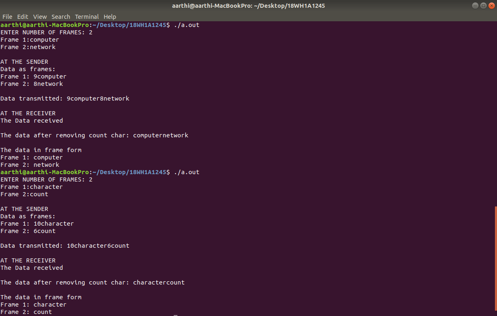
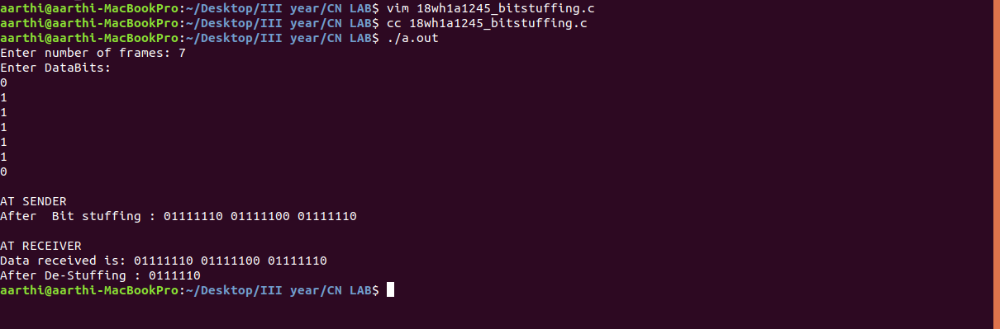
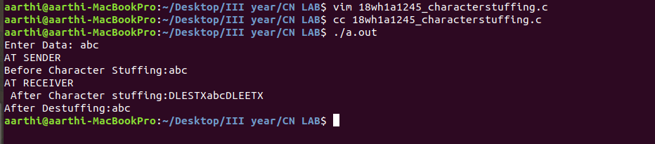

# Experiment 1
### Aim
Character Count

### Step by Step Procedure
1. First scan the number of frames required.
2. Scan the frames.
3. Find string length of each frames
4. Print the Frames at Sender.
5. Print  the Data Transmitted.
6. Print the frames at Receiver.

### Output

### Aim
Bit Stuffing

### Output

### Aim
Character Stuffing

### Output

